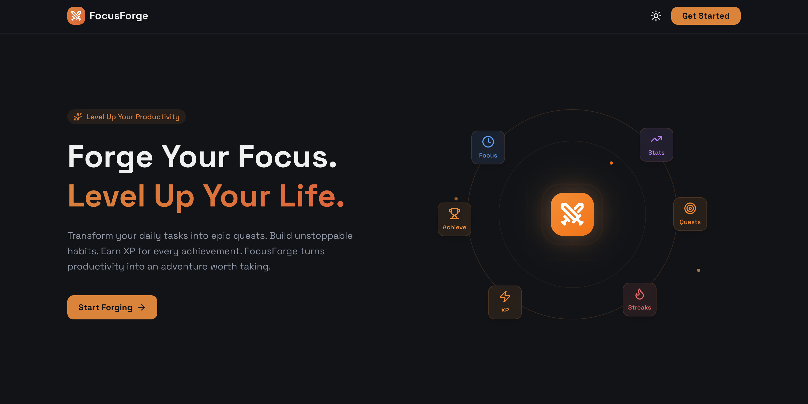
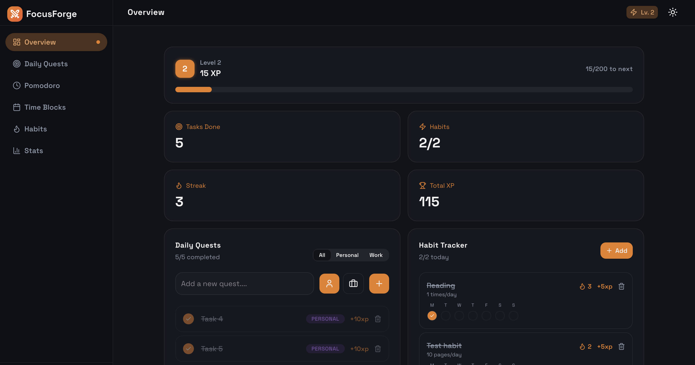
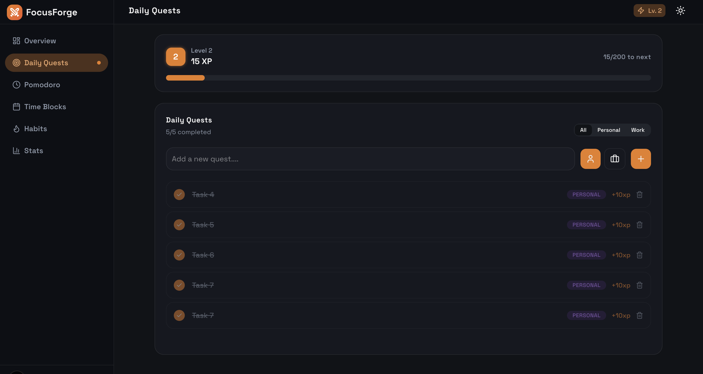
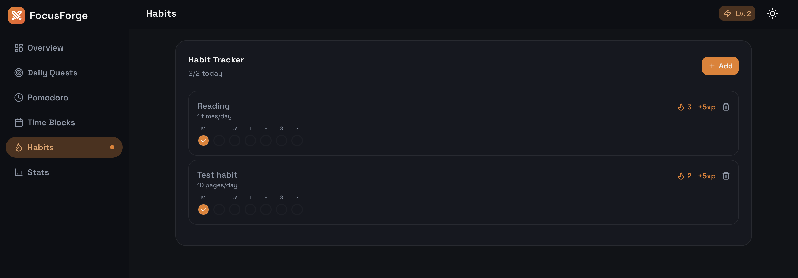
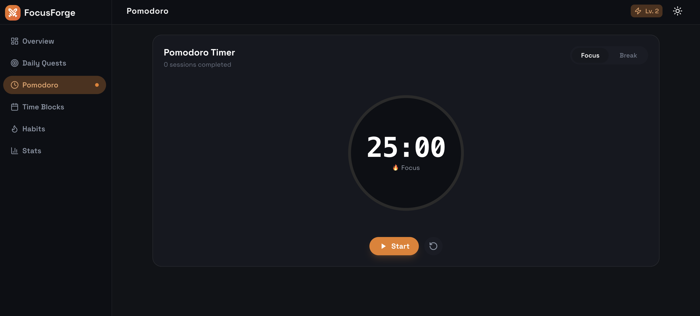
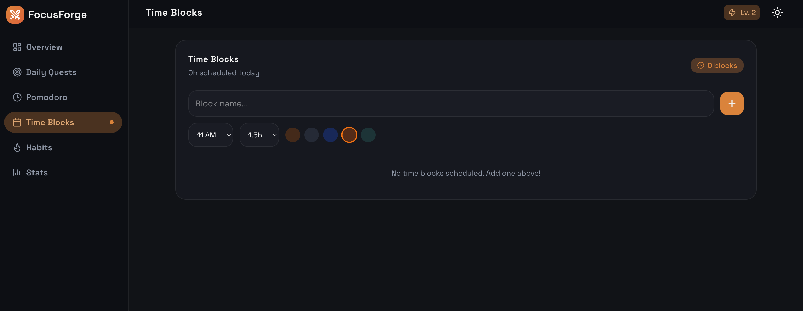
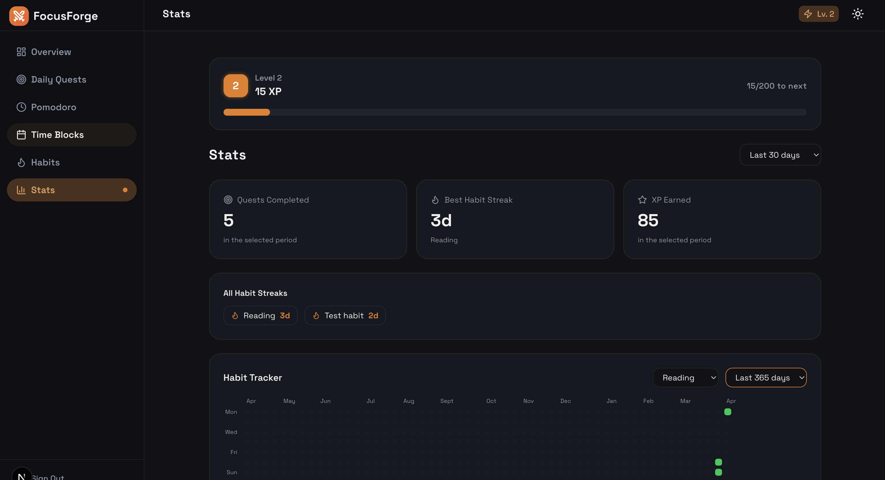

# FocusForge

> Turn your daily work into a game. Earn XP, build streaks, and level up by completing real tasks and habits.



---

## Features

### 🏠 Landing Page
A clean introduction to FocusForge — explains the concept and lets users sign up or sign in to get started.


---

### 🗺️ Overview Dashboard
A single glance shows everything — your XP progress, tasks done today, habit completions, and current streak. Two quick-access panels for Daily Quests and Habits sit side by side.



---

### ⚔️ Daily Quests
Add tasks for the day, tag them as Personal or Work, and mark them done to earn XP. Uncompleting a task deducts XP — so it stays honest.



---

### 🔥 Habit Tracker
Build lasting habits with daily goal tracking. Set a target (e.g. 10 pages/day), log partial progress any day of the week, and watch your streak grow. Each day shows a ring that fills based on how much of your goal you completed.



---

### ⏱️ Pomodoro Timer
Work in focused 25-minute sessions with built-in breaks. Each completed focus session awards 15 XP and adds to your session count for the day.



---

### 📅 Time Blocks
Plan your day visually. Add time blocks with a title, category, and start/end time to keep your schedule structured and visible.



---

### 📊 Stats
Track your performance over time — last 7, 30, 90, or 365 days. View quests completed, your best habit streak, total XP earned, and a GitHub-style heatmap showing your habit history day by day.



---

## The XP & Levelling System

Everything you complete earns XP. Enough XP and you level up — with each level requiring more XP than the last.

| Action | XP |
|---|---|
| Complete a quest | Varies (10–50 XP) |
| Complete a daily habit goal | +5 XP |
| Finish a Pomodoro session | +15 XP |

Progress is tracked in the XP bar visible across every page.

---

## Tech Stack

| Layer | Technology |
|---|---|
| Frontend | Next.js 15, Tailwind CSS, Redux Toolkit |
| Backend | FastAPI (Python) |
| Database | PostgreSQL via Neon |
| Auth | JWT (JSON Web Tokens) |

---

## Getting Started

### Prerequisites
- Node.js 18+
- Python 3.11+
- A [Neon](https://neon.tech) PostgreSQL database

### Backend
```bash
cd backend
pip install -r requirements.txt
# Create a .env file with DATABASE_URL and SECRET_KEY
uvicorn app.main:app --reload
```

### Frontend
```bash
cd frontend
npm install
# Create a .env.local file with NEXT_PUBLIC_API_URL=http://localhost:8000
npm run dev
```

Open [http://localhost:3000](http://localhost:3000) to see the app.

> **Screenshots** — save these to `frontend/public/screenshots/` to complete the README:
>
> | File | Page |
> |---|---|
> | `landing.png` | `/` — landing page |
> | `overview.png` | `/dashboard` — overview with stat cards |
> | `quests.png` | `/dashboard/daily-quests` |
> | `habits.png` | `/dashboard/habits` |
> | `pomodoro.png` | `/dashboard/pomodoro` |
> | `time-blocks.png` | `/dashboard/time-blocks` |
> | `stats.png` | `/dashboard/stats` |

---

## Who Is It For?

Students, developers, freelancers — anyone who struggles to stay consistent. FocusForge makes productivity feel rewarding by tying everything you do to visible, tangible progress.
